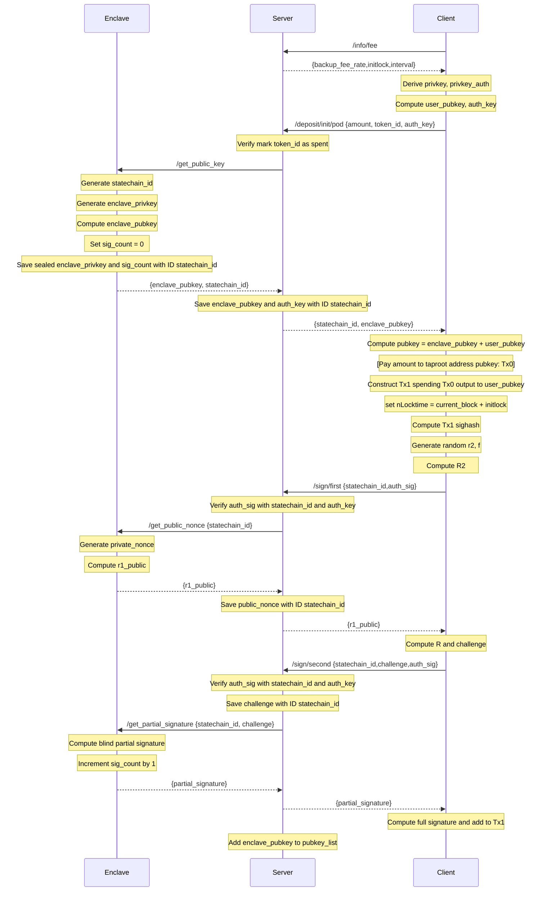

# Deposit sequence diagram

```mermaid
sequenceDiagram
    participant Enclave
    participant Server
    participant Client
    Client->>Server: /info/fee
    Server-->>Client: {backup_fee_rate,initlock,interval}
    note over Client: Derive privkey, privkey_auth
    note over Client: Compute user_pubkey, auth_key
    Client->>Server: /deposit/init/pod {amount, token_id, auth_key}
    note over Server: Verify mark token_id as spent
    Server->>Enclave: /get_public_key
    note over Enclave: Generate statechain_id    
    note over Enclave: Generate enclave_privkey
    note over Enclave: Compute enclave_pubkey
    note over Enclave: Set sig_count = 0
    note over Enclave: Save sealed enclave_privkey and sig_count with ID statechain_id
    Enclave-->>Server: {enclave_pubkey, statechain_id}
    note over Server: Save enclave_pubkey and auth_key with ID statechain_id
    Server-->>Client: {statechain_id, enclave_pubkey}    
    note over Client: Compute pubkey = enclave_pubkey + user_pubkey
    note over Client: [Pay amount to taproot address pubkey: Tx0]
    note over Client: Construct Tx1 spending Tx0 output to user_pubkey
    note over Client: set nLocktime = current_block + initlock
    note over Client: Compute Tx1 sighash
    note over Client: Generate random r2, f 
    note over Client: Compute R2
    Client->>Server: /sign/first {statechain_id,auth_sig}
    note over Server: Verify auth_sig with statechain_id and auth_key
    Server->>Enclave: /get_public_nonce {statechain_id}
    note over Enclave: Generate private_nonce
    note over Enclave: Compute r1_public
    Enclave-->>Server: {r1_public}
    note over Server: Save public_nonce with ID statechain_id
    Server-->>Client: {r1_public}
    note over Client: Compute R and challenge
    Client->>Server: /sign/second {statechain_id,challenge,auth_sig}
    note over Server: Verify auth_sig with statechain_id and auth_key
    note over Server: Save challenge  with ID statechain_id
    Server->>Enclave: /get_partial_signature {statechain_id, challenge}
    note over Enclave: Compute blind partial signature
    note over Enclave: Increment sig_count by 1
    Enclave-->>Server: {partial_signature}
    Server-->>Client: {partial_signature}
    note over Client: Compute full signature and add to Tx1
    note over Server: Add enclave_pubkey to pubkey_list
```
