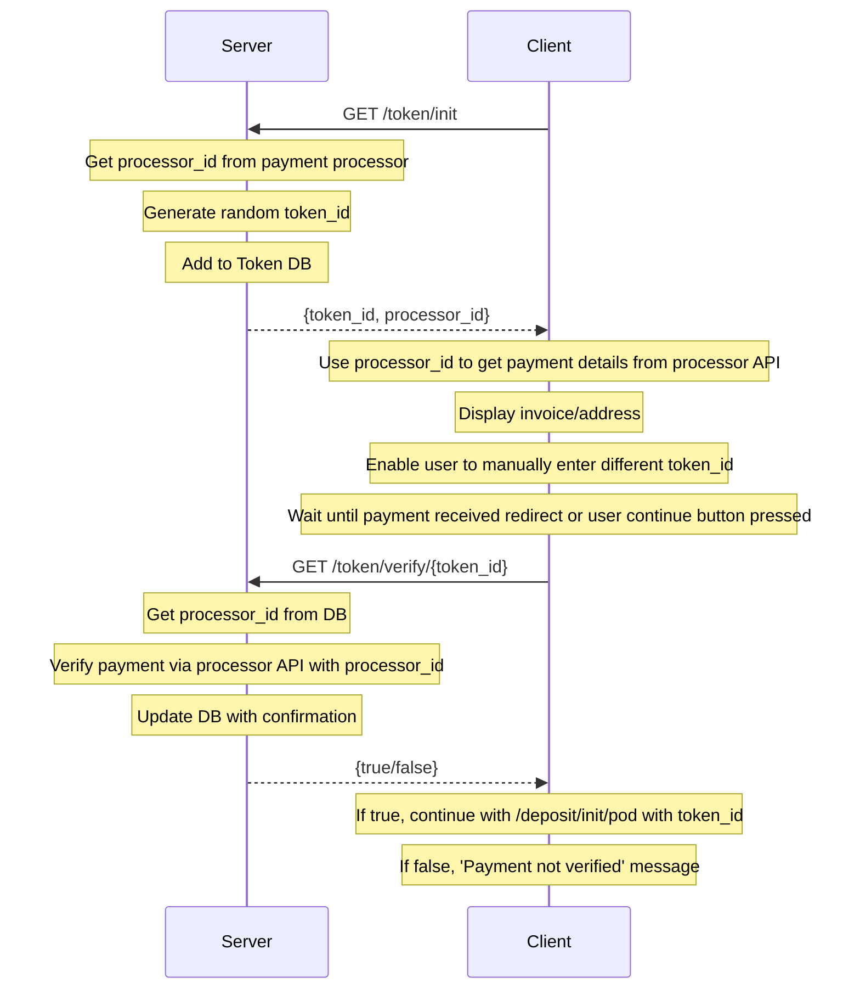

# Token payment system

To enable many ways to give permission to deposit coins, the deposit permission system will utilize tokens that can be issued separately to the deposit process and then redeemed on deposit. This will enable fees to be paid via any mechanism and also managed separately. 

## Tokens

**Deposit tokens** will be managed via a new table `tokens` (which is a separate DB to the main `mercury` DB so separate permissions can be applied). This table will have 4 columns: `token_id` (Uuid), `processor_id` (string), `confirmed` (boolean) and `spent` (boolean). 

The `tokens` table will be interacted with via two new mercury server functions: `token_init` and `token_verify`. 

The `token_init` function will take no arguments. This function will generate a new random `token_id` (Uuid) and then call the payment processor API (`https://docs.swiss-bitcoin-pay.ch/checkout`) with this as the label and the fixed configured fee. The payment processor API will then return a JSON object containing the `processor_id`. 
This `processor_id` will then be added to the token DB with the `token_id` and `confirmed = false` and `spent = false`. The `token_id` and `processor_id` are returned to the client. 

The client/wallet then retrieves/displays the payment information (Lightning invoice and on-chain address) from the payment processor API using `processor_id` (e.g. `https://checkout.swiss-bitcoin-pay.ch/{processor_id}`). 

The `token_verify` function will take one argument (`token_id`) and return a boolean (`valid`). This function will first query the `tokens` table with the `token_id`. If no entry found, it will return an error. If a row is found, it will return false if `spent = true`. If `spent = false` and `confirmed = true` it will return `true`. If `spent = false` and `confirmed = false` it will then query the payment processor API with the `processor_id` to verify payment: if confirmed it will update `confirmed = true` and return `true`. 

### Deposit process

The new deposit process will verify that a valid (i.e. confirmed and unspent) token is in the `tokens` table before creating a `statechain_id`. 
When `deposit_init` is called, a `token_id` must now be supplied as an argument. This function will then query the `tokens` table with the `token_id`. 

## Sequence

