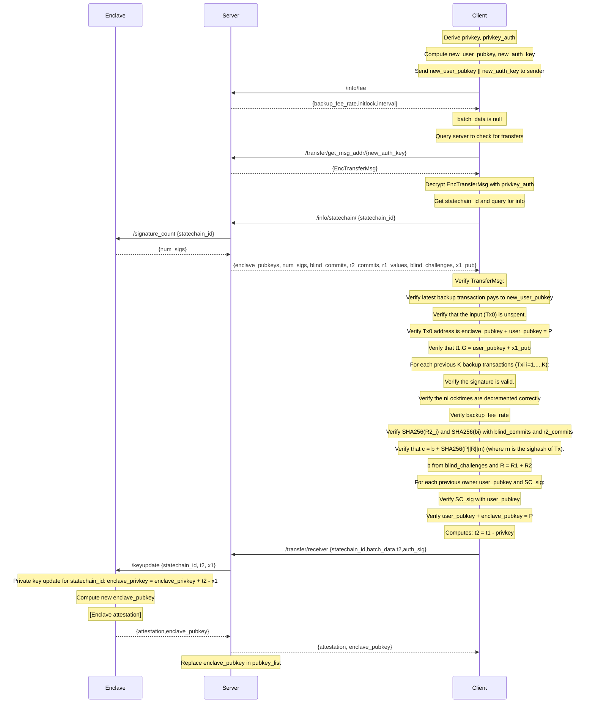

# Transfer Receiver sequence diagram

```mermaid
sequenceDiagram
    participant Enclave
    participant Server
    participant Client
    note over Client: Derive privkey, privkey_auth
    note over Client: Compute new_user_pubkey, new_auth_key
    note over Client: Send new_user_pubkey || new_auth_key to sender
    Client->>Server: /info/fee
    Server-->>Client: {backup_fee_rate,initlock,interval}
    note over Client: batch_data is null
    note over Client: Query server to check for transfers
    Client->>Server: /transfer/get_msg_addr/{new_auth_key}
    Server-->>Client: {EncTransferMsg}
    note over Client: Decrypt EncTransferMsg with privkey_auth
    note over Client: Get statechain_id and query for info
    Client->>Server: /info/statechain/ {statechain_id}
    Server->>Enclave: /signature_count {statechain_id}
    Enclave-->>Server: {num_sigs}
    Server-->>Client: {enclave_pubkeys, num_sigs, blind_commits, r2_commits, r1_values, blind_challenges, x1_pub}
    note over Client: Verify TransferMsg:
    note over Client: Verify latest backup transaction pays to new_user_pubkey
    note over Client: Verify that the input (Tx0) is unspent.
    note over Client: Verify Tx0 address is enclave_pubkey + user_pubkey = P
    note over Client: Verify that t1.G = user_pubkey + x1_pub
    note over Client: For each previous K backup transactions (Txi i=1,...,K):
    note over Client:   Verify the signature is valid.
    note over Client:   Verify the nLocktimes are decremented correctly
    note over Client:   Verify backup_fee_rate
    note over Client:   Verify SHA256(R2_i) and SHA256(bi) with blind_commits and r2_commits
    note over Client:   Verify that c = b + SHA256(P||R||m) (where m is the sighash of Tx).
    note over Client:   b from blind_challenges and R = R1 + R2
    note over Client: For each previous owner user_pubkey and SC_sig:
    note over Client:   Verify SC_sig with user_pubkey
    note over Client:   Verify user_pubkey + enclave_pubkey = P
    note over Client: Computes: t2 = t1 - privkey
    Client->>Server: /transfer/receiver {statechain_id,batch_data,t2,auth_sig}
    Server->>Enclave: /keyupdate {statechain_id, t2, x1}
    note over Enclave: Private key update for statechain_id: enclave_privkey = enclave_privkey + t2 - x1
    note over Enclave: Compute new enclave_pubkey
    note over Enclave: [Enclave attestation]
    Enclave-->>Server: {attestation,enclave_pubkey}
    Server-->>Client: {attestation, enclave_pubkey}
    note over Server: Replace enclave_pubkey in pubkey_list
```
