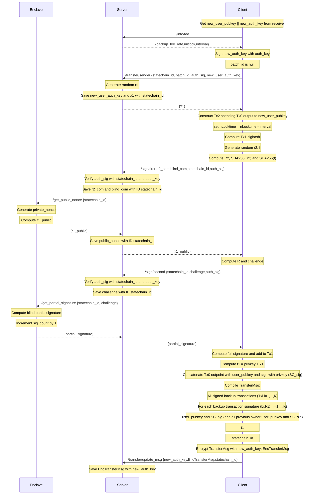

# Transfer sender sequence diagram

```mermaid
sequenceDiagram
    participant Enclave
    participant Server
    participant Client
    note over Client: Get new_user_pubkey || new_auth_key from receiver
    Client->>Server: /info/fee
    Server-->>Client: {backup_fee_rate,initlock,interval}
    note over Client: Sign new_auth_key with auth_key
    note over Client: batch_id is null
    Client->>Server: /transfer/sender {statechain_id, batch_id, auth_sig, new_user_auth_key}
    note over Server: Generate random x1
    note over Server: Save new_user_auth_key and x1 with statechain_id
    Server-->>Client: {x1}
    note over Client: Construct Tx2 spending Tx0 output to new_user_pubkey
    note over Client: set nLocktime = nLocktime - interval
    note over Client: Compute Tx1 sighash
    note over Client: Generate random r2, f 
    note over Client: Compute R2, SHA256(R2) and SHA256(f)
    Client->>Server: /sign/first {r2_com,blind_com,statechain_id,auth_sig}
    note over Server: Verify auth_sig with statechain_id and auth_key
    note over Server: Save r2_com and blind_com with ID statechain_id
    Server->>Enclave: /get_public_nonce {statechain_id}
    note over Enclave: Generate private_nonce
    note over Enclave: Compute r1_public
    Enclave-->>Server: {r1_public}
    note over Server: Save public_nonce with ID statechain_id
    Server-->>Client: {r1_public}
    note over Client: Compute R and challenge
    Client->>Server: /sign/second {statechain_id,challenge,auth_sig}
    note over Server: Verify auth_sig with statechain_id and auth_key
    note over Server: Save challenge with ID statechain_id
    Server->>Enclave: /get_partial_signature {statechain_id, challenge}
    note over Enclave: Compute blind partial signature
    note over Enclave: Increment sig_count by 1
    Enclave-->>Server: {partial_signature}
    Server-->>Client: {partial_signature}
    note over Client: Compute full signature and add to Tx1
    note over Client: Compute t1 = privkey + x1
    note over Client: Concatenate Tx0 outpoint with user_pubkey and sign with privkey (SC_sig)
    note over Client: Compile TransferMsg: 
    note over Client: All signed backup transactions (Txi i=1,...,K)
    note over Client: For each backup transaction signature (bi,R2_i i=1,...,K)
    note over Client: user_pubkey and SC_sig (and all previous owner user_pubkey and SC_sig)
    note over Client: t1
    note over Client: statechain_id
    note over Client: Encrypt TransferMsg with new_auth_key: EncTransferMsg
    Client->>Server: /transfer/update_msg {new_auth_key,EncTransferMsg,statechain_id}
    note over Server: Save EncTransferMsg with new_auth_key
```
