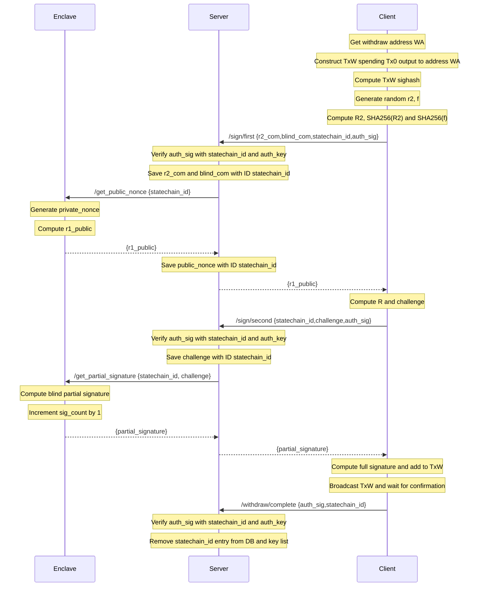

```mermaid
sequenceDiagram
    participant Enclave
    participant Server
    participant Client
    note over Client: Get withdraw address WA
    note over Client: Construct TxW spending Tx0 output to address WA
    note over Client: Compute TxW sighash
    note over Client: Generate random r2, f
    note over Client: Compute R2, SHA256(R2) and SHA256(f)
    Client->>Server: /sign/first {r2_com,blind_com,statechain_id,auth_sig}
    note over Server: Verify auth_sig with statechain_id and auth_key
    note over Server: Save r2_com and blind_com with ID statechain_id
    Server->>Enclave: /get_public_nonce {statechain_id}
    note over Enclave: Generate private_nonce
    note over Enclave: Compute r1_public
    Enclave-->>Server: {r1_public}
    note over Server: Save public_nonce with ID statechain_id
    Server-->>Client: {r1_public}
    note over Client: Compute R and challenge
    Client->>Server: /sign/second {statechain_id,challenge,auth_sig}
    note over Server: Verify auth_sig with statechain_id and auth_key
    note over Server: Save challenge  with ID statechain_id
    Server->>Enclave: /get_partial_signature {statechain_id, challenge}
    note over Enclave: Compute blind partial signature
    note over Enclave: Increment sig_count by 1
    Enclave-->>Server: {partial_signature}
    Server-->>Client: {partial_signature}
    note over Client: Compute full signature and add to TxW
    note over Client: Broadcast TxW and wait for confirmation
    Client->>Server: /withdraw/complete {auth_sig,statechain_id}
    note over Server: Verify auth_sig with statechain_id and auth_key
    note over Server: Remove statechain_id entry from DB and key list
```
